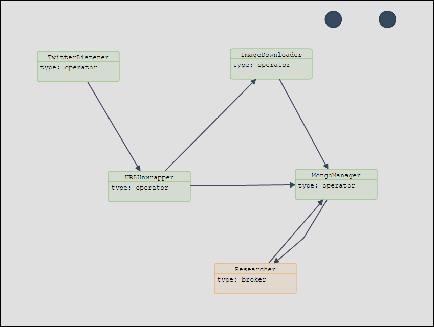

# <a href="http://openzoo.org" target="_ext">OpenZoo</a>
A framework for distributed stream/batch processing

##Prerequisites:
- Apache Tomcat 7 for the OpenZUI and the servers. Apache Tomcat 8 should also work, but it is not tested yet.
- RedisIO for storing and exchanging framework parameters.
- RabbitMQ server for the communication between the services.
- Netbeans 8 for developing the services and creating the war files of the services and the OpenZUI.
- MongoDB 2.6 or higher for storing results.
- Twitter authorization tokens (https://dev.twitter.com/oauth/overview/application-owner-access-tokens) for using demonstration topology described in the sequel.

##Installation
1. Download the whole repository, containing the following services:
  - OpenZUI: The GUI to the OpenZoo framework
  - OpenZooService: The basic service functionality, to be inherited by all services
  - ServerResources: A web service for retrieving server capacity/load information, to be installed on every OpenZoo server
  - ImageDownloader: A dummy service for downloading images
  - MongoManager: A test service for accessing MongoDB
  - TwitterListener: A test service for wrapping the TwitterStream API
  - URLUnwrapper: A test service for unwrapping short URLs
  - Researcher: A test service for forwarding user requests
2. Run Tomcat 7 server on all available servers and create a password protected user on each tomcat server.
3. Install RedisIO on a server.
4. Open projects with Netbeans 8.
5. Build projects, starting by ServerResources, since it needs to be included in the OpenZUI war later. This is going to be done automatically (on -post-dist).
6. Edit OpenZUI/web/config.json:
  - update keyvalue.host and keyvalue.port with the RedisIO server and port
  - update localRepository with a folder with read/write permissions for the tomcat user, anywhere on the server where OpenZUI will be installed.
  - update demouser.username and demouser.passwd if necessary
7. Deploy OpenZUI project to a tomcat server. Everything else can be done through OpenZUI (http://TOMCAT_SERVER:TOMCAT_PORT/OpenZUI/).

##Usage

- All available servers are registered in OpenZUI.
- Service templates for Netbeans 8 can be downloaded through the appropriate OpenZUI interface.
- The templates can be opened in Netbeans 8 for implementing the services.
- The resulting war files are uploaded in OpenZUI.
- The topology is drawn in OpenZUI.
- The topology is deployed, started and monitored in OpenZUI.

##Example

A set of test services are provided for demonstrating the usage of the OpenZoo framework.
The user has to upload the 5 test services in OpenZUI and create the following topology:

We define 1 instance of TwitterListener, 2 instances of URLUnwrapper, 2 instances of ImageDownloader, 1 instance of MongoManager and 1 instance of Researcher.

- TwitterListener retrieves tweets using specific keywords (e.g. ["fashion", "dress"]).
- URLUnwrapper filters out tweets containing image URLs and unwrapps short URLs. They are sent to the ImageDownloader. The ones that contain coordinates are sent to the first instance of the ImageDownloader, the rest are sent to the second instance. Tweets without URLs are sent directly to the MongoManager.
- ImageDownloader should normally download images. This function is not implemented, since this is just a demonstration case. The results of ImageDownloader are sent also to MongoManager.
- MongoManager saves the tweets in a collection and the image URLs in another collection.
- The Researcher acts as a request broker. It accepts web requests (POSTs) like the following: {"method": "newer/hotter", "num": 20}. It forwards the requests into the system, waits for the answer and responses back to the caller.

The parameters for the topology nodes are:

1. TwitterListener
  - keywords: ["fashion", "dress"]
  - consumerKey, consumerSecret, accessToken, accessTokerSecret: Twitter credentials, ( created in https://apps.twitter.com/).
  - instances: 1
  - threads per core: 0

2. URLUnwrapper:
  - instances: 2
  - threads per core: 2

3. ImageDownloader:
  - instances: 2
  - threads per core: 1

4. MongoManager:
  - mongo_collection_messages, mongo_collection_images, mongo_database: Mongo database and collections on a MongoDB server, accessible by a specific user
  - instances: 1
  - threads per core: 0

5. Researcher
  - instances: 1
  - threads per core: 0

After deploying and starting the topology, statistics can be seen in the Topology monitoring interface and the results of the processing can be seen in the MongoDB.
